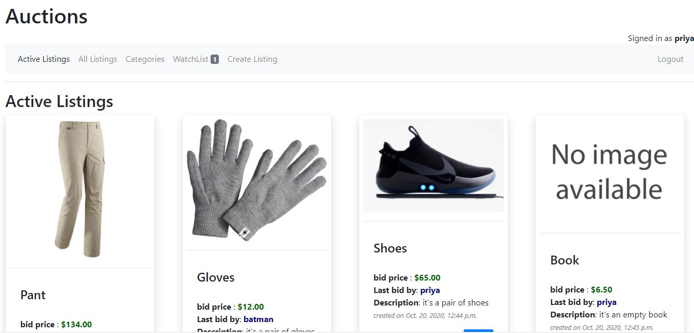

# Auction

Check it out here:
[auctions-system.herokuapp.com](https://auctions-system.herokuapp.com/)




It's a Django web application to create a auctioning system for the Harvard CS50's Web Programming with python and javascript.


## To run 
```python manage.py runserver```

